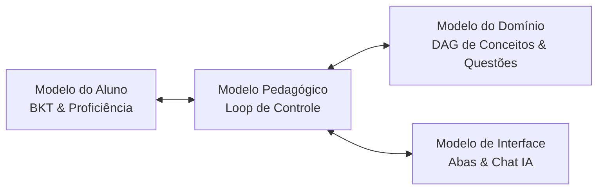
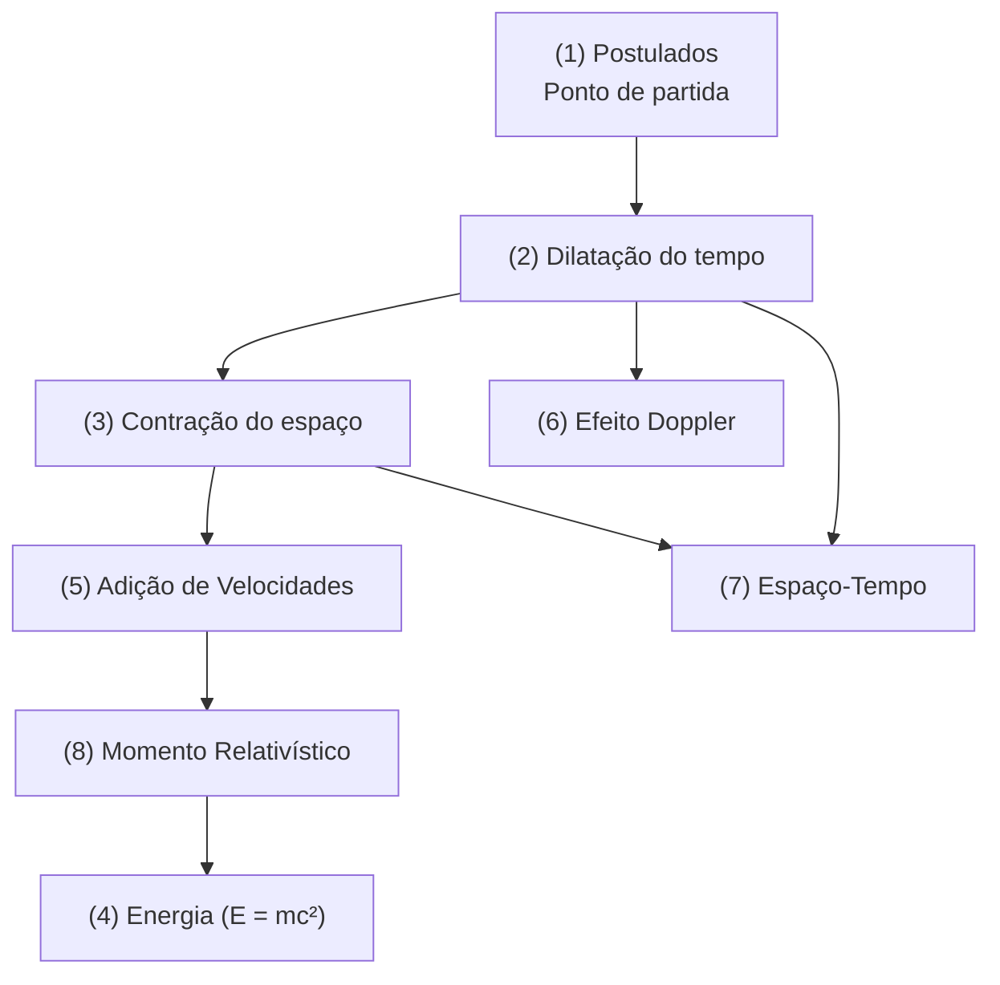

# Lógica de Funcionamento do ITS · Relatividade Restrita

Este documento descreve a arquitetura lógica e os modelos cognitivos que sustentam o **Sistema de Tutoria Inteligente (ITS)** para o ensino de Relatividade Especial/Restrita.

O sistema adota a arquitetura de Burns & Capps para tutores inteligentes, composta por quatro módulos integrados:

---

## 🧠 1. Modelo do Aluno & Bayesian Knowledge Tracing (BKT)

O estado cognitivo do aluno é modelado de forma probabilística para cada conceito do domínio usando o algoritmo **BKT**. A proficiência ($P(L)$) representa a chance de o estudante dominar o conceito e varia de `0.0` a `1.0` (exibida como $0\%$ a $100\%$).

### Parâmetros do BKT
*   **$P(L_0) = 0.15$ (Domínio Inicial):** A probabilidade de o aluno já conhecer o conceito antes de iniciar os testes.
*   **$P(G) = 0.25$ (Chute / Guess):** A chance de o aluno acertar a questão por escolha aleatória (1 alternativa em 4 opções).
*   **$P(S) = 0.10$ (Deslize / Slip):** A chance de o aluno errar a questão por distração, mesmo dominando o assunto.
*   **$P(T) = 0.20$ (Transição / Aprendizado):** A probabilidade de o aluno aprender o conceito após responder corretamente.

### Regras de Atualização
A cada resposta dada pelo aluno, a proficiência é recalculada usando o **Teorema de Bayes**:

1.  **Em caso de Acerto:**
    $$P(L_{cond}) = \frac{P(L) \cdot (1 - P(S))}{P(L) \cdot (1 - P(S)) + (1 - P(L)) \cdot P(G)}$$
    $$P(L_{novo}) = P(L_{cond}) + (1 - P(L_{cond})) \cdot P(T)$$

2.  **Em caso de Erro:**
    $$P(L_{cond}) = \frac{P(L) \cdot P(S)}{P(L) \cdot P(S) + (1 - P(L)) \cdot (1 - P(G))}$$
    $$P(L_{novo}) = P(L_{cond})$$

3.  **Uso de Dicas (Tutor IA):**
    Consultar o chat do tutor aplica uma penalidade imediata de **$-10\%$ (fixo)** sobre a proficiência do nó atual, incentivando o aluno a tentar resolver os problemas por conta própria antes de solicitar ajuda.

### Critério de Domínio
O aluno atinge o domínio do conceito quando sua proficiência calculada é **$\ge 70\%$** ($0.70$).

---

## 📐 2. Modelo do Domínio (Grafo de Pré-requisitos)

O conhecimento é estruturado como um **Grafo Acíclico Direcionado (DAG)**, onde cada conceito possui uma lista de pré-requisitos pedagógicos obrigatórios no arquivo [concepts.js](file:///home/gildo-duarte/Downloads/IA/its-relatividade/src/data/concepts.js).

### Árvore Pedagógica de Aprendizado

### Regra de Liberação de Nós
Um nó de conceito transita entre três estados possíveis:
*   `locked` (Bloqueado): Pelo menos um de seus pré-requisitos ainda possui proficiência $< 70\%$.
*   `active` (Liberado/Ativo): Todos os pré-requisitos foram dominados ($\ge 70\%$). O aluno pode clicar para estudar.
*   `done` (Concluído): O aluno atingiu $\ge 70\%$ na proficiência deste próprio nó.

---

## 🎯 3. Modelo Pedagógico (Loop de Controle)

Implementado no loop principal de [App.jsx](file:///home/gildo-duarte/Downloads/IA/its-relatividade/src/App.jsx), gerencia o fluxo de tela do aluno:
*   Se o aluno acertar o problema, o BKT atualiza o valor de domínio para cima e exibe a explicação correta.
*   Se o aluno errar, o BKT reduz a proficiência e o sistema identifica o código da **concepção errônea** (*misconception*) vinculada à opção escolhida.
*   Ao avançar, se houver mais problemas no nó ativo, o próximo é exibido. Caso contrário, se o nó foi dominado, ele avança para o próximo nó liberado. Se o nó não foi dominado (concluiu as questões com proficiência $< 70\%$), as questões do mesmo nó são reiniciadas para novas tentativas de fixação.

---

## 💬 4. Modelo de Interface & Remediação com IA (Google Gemini)

O chat tutor é contextualizado de forma generativa em tempo real através da API do Gemini (usando o gancho [useGemini.js](file:///home/gildo-duarte/Downloads/IA/its-relatividade/src/hooks/useGemini.js)).

*   **Prompt Customizado:** O tutor recebe as definições do conceito ativo, a pergunta do problema e, crucialmente, a **misconception diagnosticada** (ex: *classical_velocity_addition* se o aluno tentou somar velocidades linearmente).
*   **Instrução Pedagógica:** O Gemini é instruído a não dar a resposta direta, mas sim desconstruir conceitualmente o erro de raciocínio daquela misconception específica, usando analogias simples e estimulando o raciocínio socrático.
*   **Navegação Inteligente por Abas:** Para manter o layout compacto em telas desktop, a interface lateral do painel direito separa o progresso do aluno (*Tópicos*) da documentação de consulta (*Fórmulas e Regras*), evitando a poluição visual da interface.
